## apt1 kitchen

8 objects

| 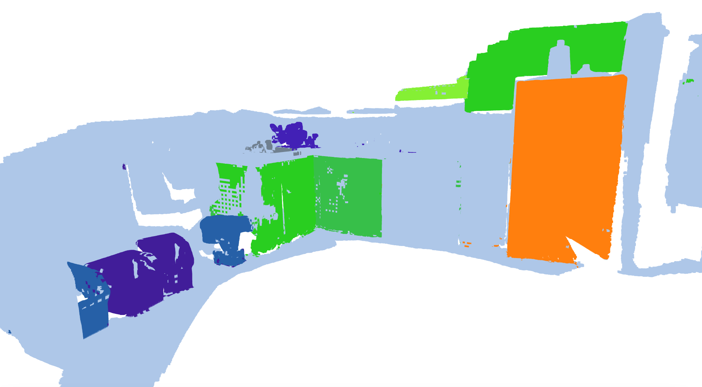 | 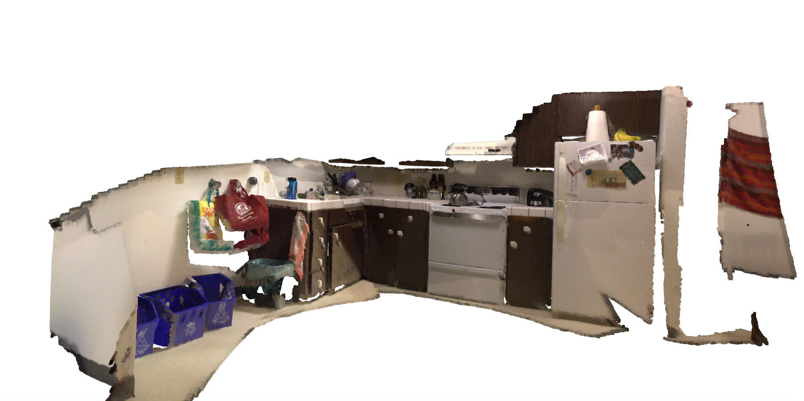 |
|--------------------------------------------------|--|

## apt1 living

6 objects

| 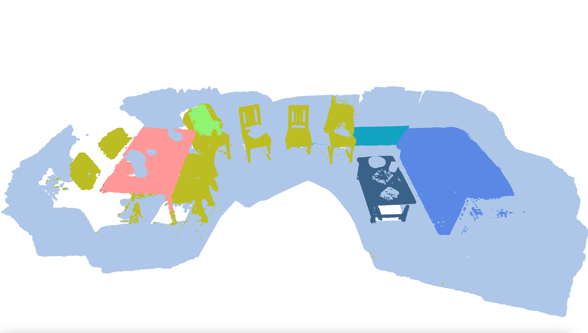 | 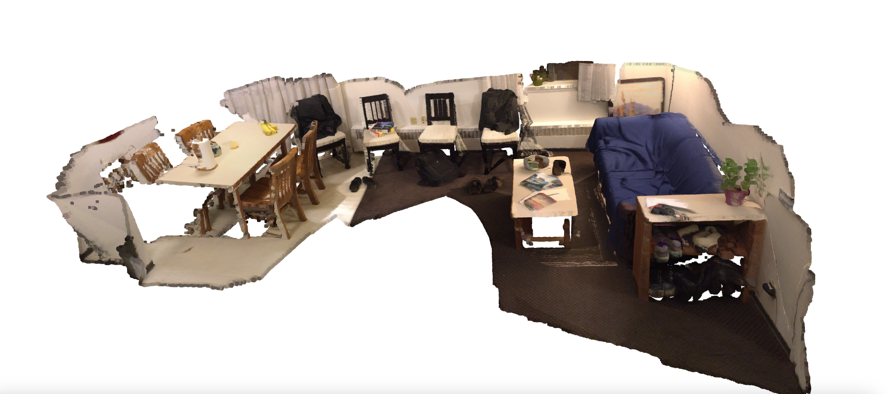 |
|--------------------------------------------------------|------------------------------------------|

## apt2 bed

5 objects

| 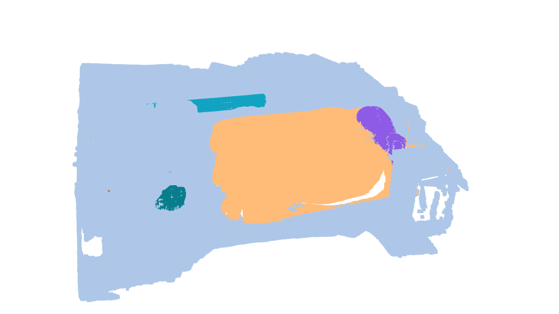 | 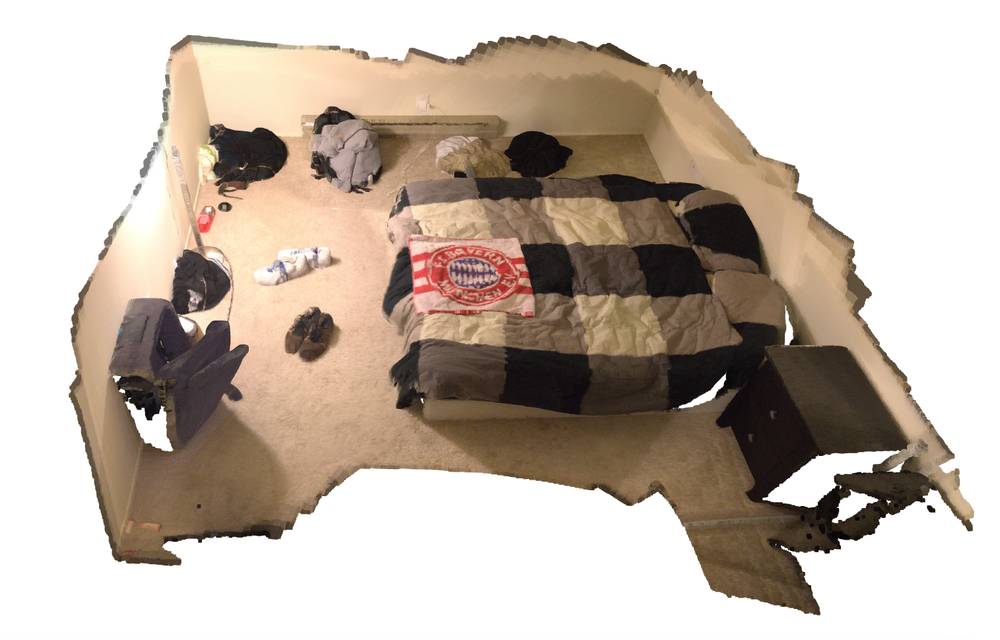 |
|----------------------------|---------------------|

## apt2 kitchen

9 objects

| 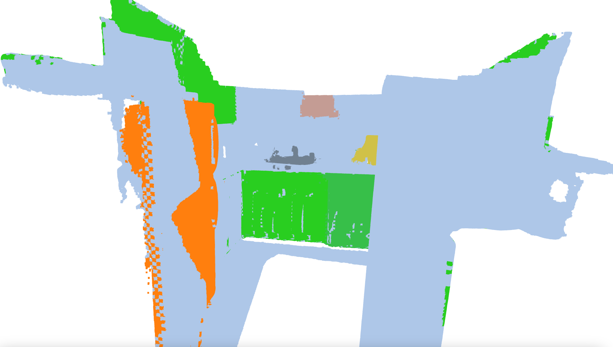 | 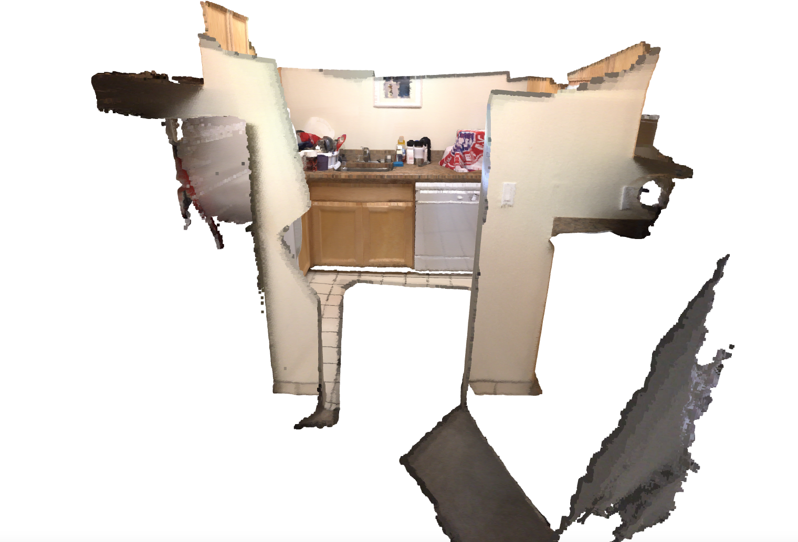 |
|--------------------------------------------------|--|

## apt2 living

11 objects

| 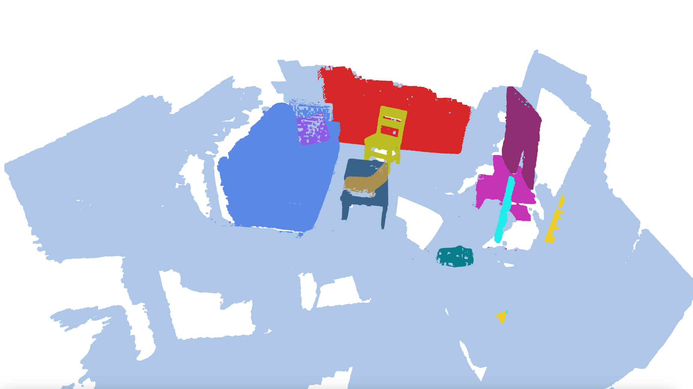 | 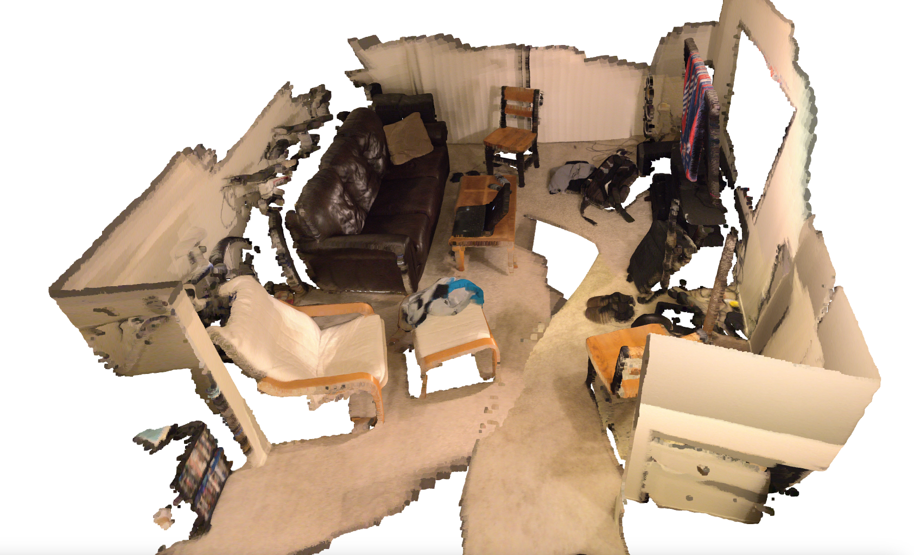 |
|--------------------------------------------------------|------------------------------------------|

## apt2 luke

19 objects

| 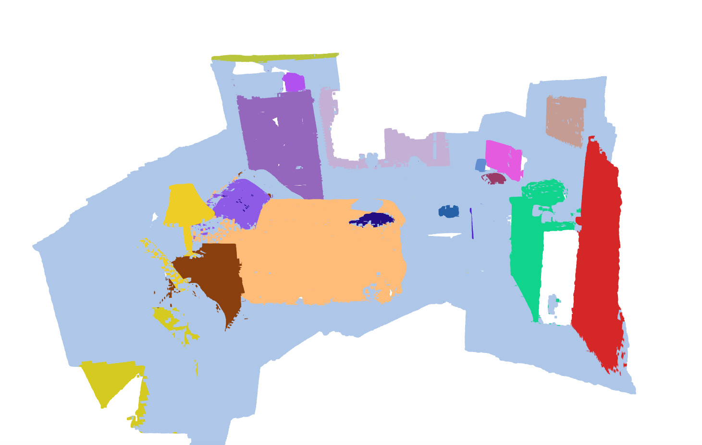 | 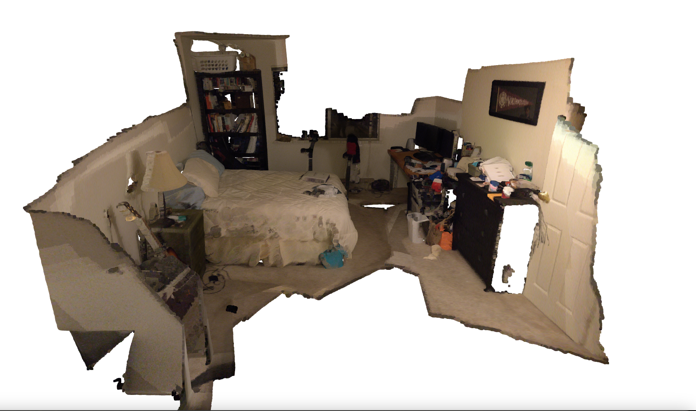 |
|----------------------------------|---------------------------|

## office2 5a

10 objects

| 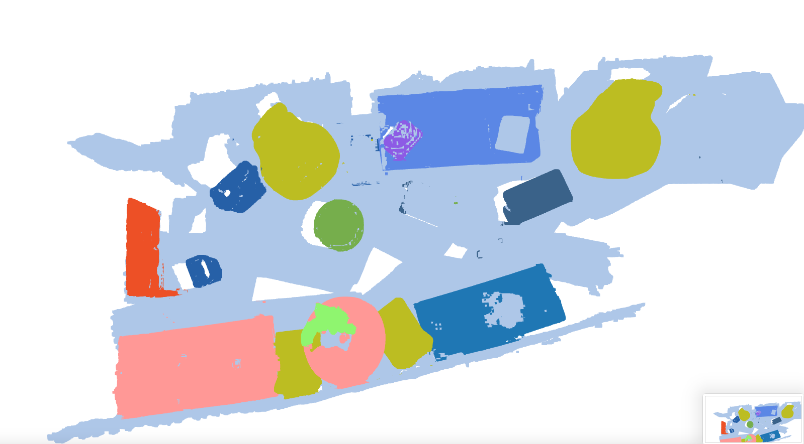 | 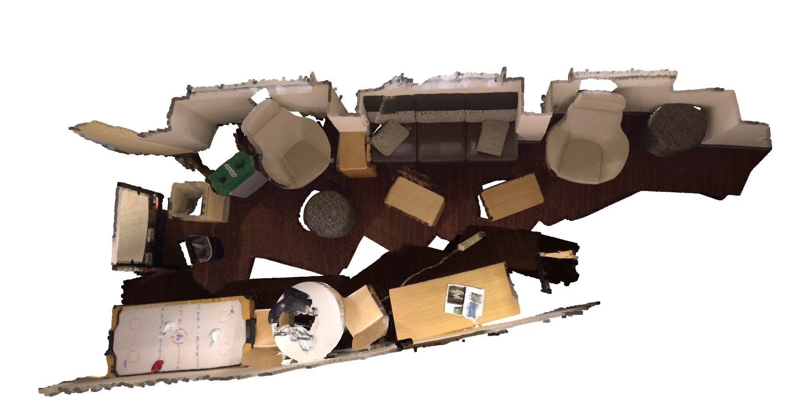 |
|-------------------------------|------------------------|

## office2 5b

7 objects

| 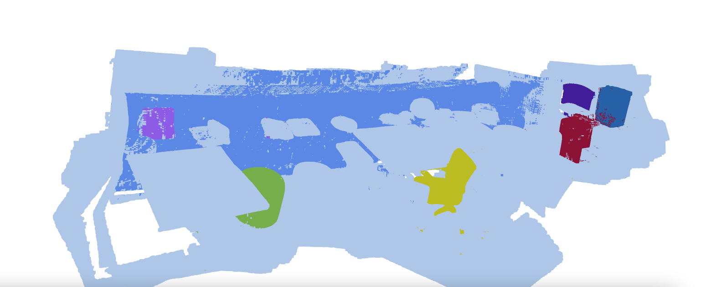 | 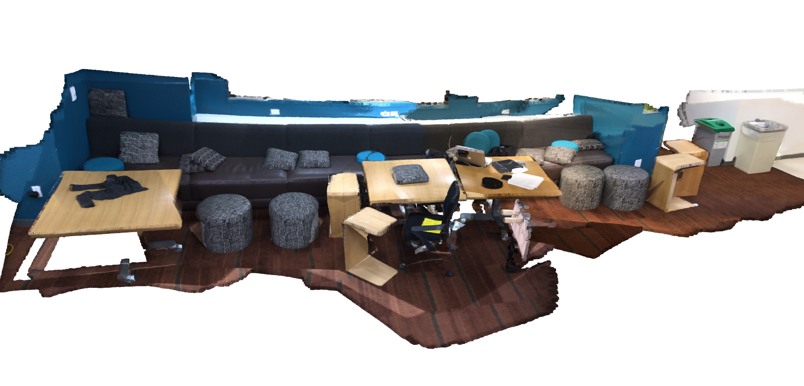 |
|-------------------------------|------------------------|
